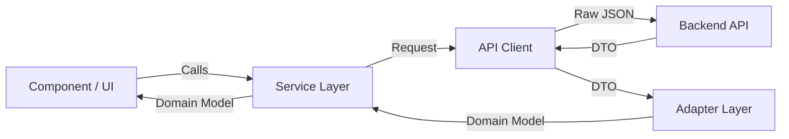

# API Layer & Adapter Pattern Guide

This directory (`lib/api`) contains the centralized networking logic for the application. We use a strictly typed **Adapter Pattern** to decouple our Frontend (UI) from the Backend (API).

## 🚀 The Integration Flow

Every data request follows this unidirectional flow. This ensures that if the Backend API changes, we only need to update the **Adapter**, not every single UI component.



1.  **Component**: Asks for data (e.g., `LoanService.getAllLoans()`).
2.  **Service**: Uses `apiClient` to fetch data from `ENDPOINTS`.
3.  **API Client**: Returns the raw **DTO** (Data Transfer Object) - _Snake Case_.
4.  **Adapter**: Transforms the **DTO** into a **Domain Model** - _Camel Case_.
5.  **Component**: Receives clean, typed, and formatted data ready for display.

---

## 🛠 Directory Structure

```
lib/
├── api/
│   ├── client.ts       # THe Axios instance (Interceptors, Auth, Base URL)
│   ├── endpoints.ts    # Registry of all API URLs
│   └── README.md       # This guide
├── adapters/
│   ├── base.adapter.ts # Interface definition
│   ├── loan.adapter.ts # Specific adapters
│   └── ...
└── services/           # (Or root of lib/) containing business logic
```

---

## 📖 How to Integrate a New API

Follow these 4 steps to replace mock data with real API calls.

### Step 1: Define the Endpoint

Add your new endpoint to `lib/api/endpoints.ts`.

```typescript
// lib/api/endpoints.ts
export const ENDPOINTS = {
  // ...
  CUSTOMERS: "/customers",
  CUSTOMER_DETAILS: (id: string) => `/customers/${id}`,
} as const;
```

### Step 2: Define the DTO (Backend Type)

Create a type that **exactly matches** the JSON response from the backend. Use `snake_case` if the backend does.

```typescript
// types/dto/customer.dto.ts
export interface CustomerDTO {
  id: string;
  full_name: string; // Match backend exactly
  phone_number: string;
  created_at: string;
}
```

### Step 3: Create the Adapter

Create an adapter in `lib/adapters/` to map DTO -> Domain.

```typescript
// lib/adapters/customer.adapter.ts
import { BaseAdapter } from "./base.adapter";
import { CustomerDTO } from "@/types/dto/customer.dto";
import { Customer } from "@/types/customer"; // Frontend type

export const CustomerAdapter: BaseAdapter<Customer, CustomerDTO> = {
  toDomain(dto: CustomerDTO): Customer {
    return {
      id: dto.id,
      name: dto.full_name, // Transform to CamelCase
      phone: dto.phone_number,
      joinedDate: new Date(dto.created_at), // Transform data types
      status: "active", // Handle missing fields with defaults
    };
  },
};
```

### Step 4: Update the Service

Consume the API and apply the adapter.

```typescript
// lib/customer.service.ts
import { apiClient } from "@/lib/api/client";
import { ENDPOINTS } from "@/lib/api/endpoints";
import { CustomerAdapter } from "@/lib/adapters/customer.adapter";
import { CustomerDTO } from "@/types/dto/customer.dto";

export const CustomerService = {
  getAll: async () => {
    // 1. Fetch DTO
    const response = await apiClient.get<CustomerDTO[]>(ENDPOINTS.CUSTOMERS);

    // 2. Adapt to Domain
    return response.data.map(CustomerAdapter.toDomain);
  },
};
```

## 🤝 Rules of Engagement

1.  **Never use `any`**: Always define a DTO type.
2.  **Separate Concerns**:
    - `client.ts` handles _how_ we fetch (Headers, Auth, Timeouts).
    - `endpoints.ts` handles _where_ we fetch.
    - `adapters` handle _what_ the data looks like.
3.  **Fail Gracefully**: If the API is missing a field, the Adapter should provide a default value or handle the null check so the UI doesn't crash.
